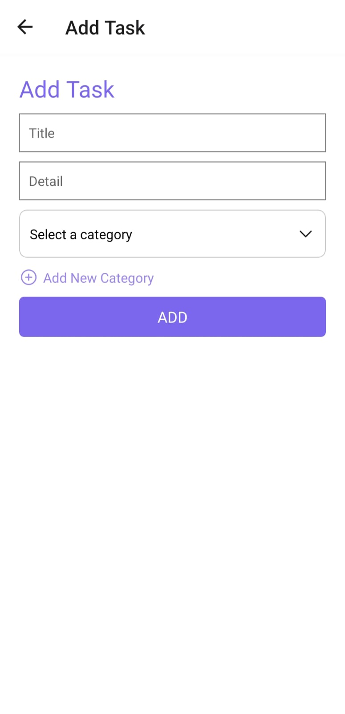

# TaskMate

A mobile Todo application built with React Native and Expo, using SQLite for local data storage. The app allows users to manage tasks by adding, editing, and filtering tasks by category and status.

## Features

- Add, edit, and delete tasks
- Filter tasks by category
- Toggle task completion status
- Persist data locally using SQLite
- Simple and intuitive user interface

## Demo

Here's a quick look at Task Mate in action:

### Screenshots

*The main screen showing all tasks.*

*Adding a new task.*

## Tech Stack

**React Native:** For building the mobile application
- **Expo SDK:** Version 51.0.28 for easy development and testing
- **SQLite:** For local data storage
- **Expo-sqlite:** Version 14.0.6 for SQLite integration with Expo

## Usage

Run the app on an Android or iOS device/emulator.
- Use the plus button to add new tasks.
- Use the filter options to view tasks by category or completion status.
- Tap on tasks to edit or mark them as completed.

## Design Choices
- Chose SQLite for local persistence due to its lightweight and fast performance for handling task data.
- Implemented a category-based filtering system to enhance task management.
- Used a simple and clean UI to focus on usability and ease of navigation.
## Challenges Encountered
- **Navigation State Issues:** One challenge was ensuring that task and category data refreshed correctly when navigating to certain screens, such as the edit screen. Initially, the        `fetchTaskData` and `fetchCategories` functions were only called once, causing data inconsistencies when returning to the screen. This was resolved by using the `useFocusEffect` hook from React Navigation, which allows functions to be executed every time the screen is focused, ensuring that the latest data is always displayed.
- **SQLite Integration:** Initial difficulties with setting up SQLite on Expo. Solved by using `expo-sqlite/legacy` library and following documentation carefully.
## Future Enhancements

- **Implement Notifications for Upcoming Tasks:**  
  Add push notifications to remind users of pending or due tasks, helping them stay on track with their schedules.
  
- **Support for Recurring Tasks:**  
  Introduce the ability to set recurring tasks with customizable intervals, making it easier to manage repeating activities.

- **Enhanced UI with Theming Options:**  
  Allow users to personalize the app’s appearance by offering different themes, including light and dark modes.

- **Calendar and Time Integration:**  
  Add a calendar view to visualize tasks by date, and incorporate time settings for tasks, enabling users to set deadlines or reminders directly within the app.

## Contact
Created by [Abhishek Pal](https://github.com/APCHAMPION) - feel free to contact me!
